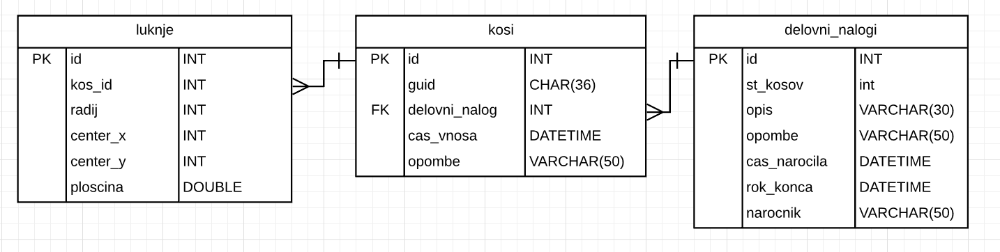

# Proaim razpis naloga

---

## Baza

Bazo sem naredil s tremi tabelami - luknje, kosi in delovni nalogi. `Kosi` sem
spremenil da ima delovni nalog namesto `varchar(30)` referenco na tabelo `delovni_nalogi`. Tabela `luknje` je se povezana s kosi preko reference. 
Indexi tabel bi bili na primarnih klucih (`id`) in pri `kosi` tabeli tudi na `guid`.

## Program

Glavni program je napisan v `Form1.cs`. Poleg tega je se `Luknja.cs`, ki definira strukturo lukenj.

Za program sem uporabil EMGU in MySql connector knjiznice.